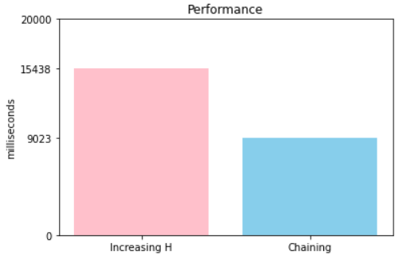
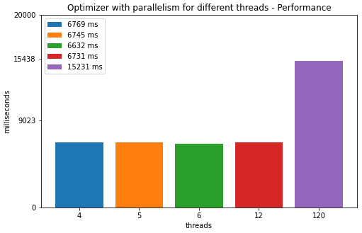
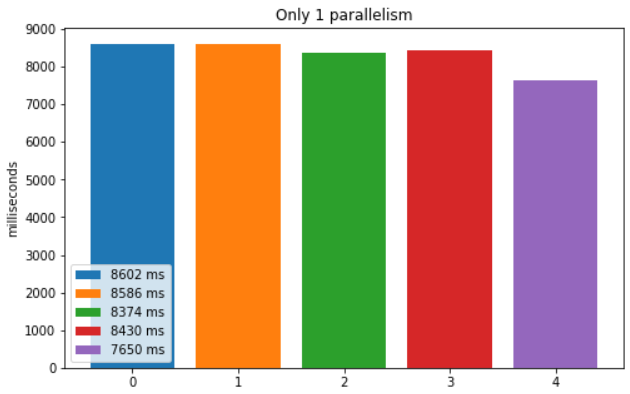
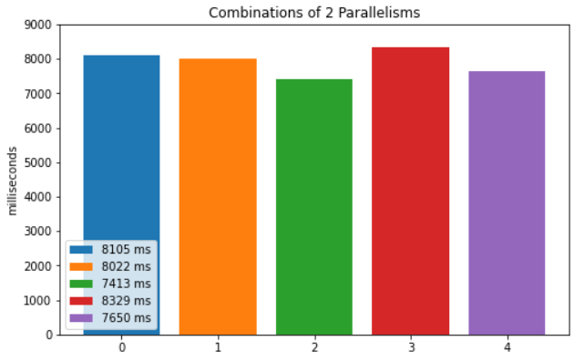
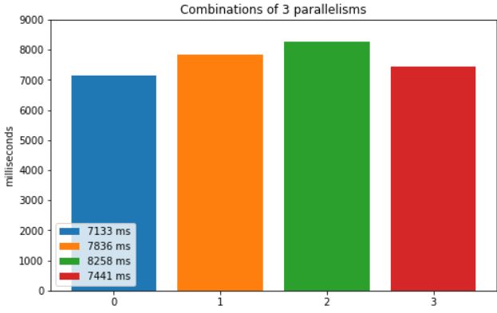
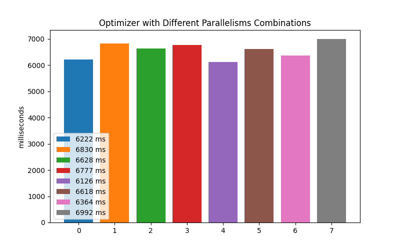

# Project Report Winter 2022

## Περιεχόμενα

[Chapter 1](#chapter-1)
* [Comments 1](#comments-1)

[Chapter 2](#chapter-2)
* [PredicateQueue](#predicatequeue)
* [Performance 2](#performance-2)

[Chapter 3](#chapter-3)
* [Job Scheduler](#job-scheduler)
* [Optimizer](#optimizer)
* [Performance 3](#performance-3)
* [Changes Optimizations](#changes-optimizations)

[Final Model](#final-model)

[System Specifications](#system-specifications)

---

## Chapter 1

Στο πρώτο παραδοτέο, είχαμε σχεδιάσει έτσι την δομή του προγράμματος ώστε να υλοποιείται καθαρά ο αλγόριθμος hopscotch hashing όπως περιγράφεται στην εκφώνηση. Μάλιστα επεκτείναμε τον αλγόριθμο ώστε να κάνει και κυκλική αναζήτηση όπως είχε αναφερθεί στο μάθημα. Γενικά ακολουθήσαμε πιστά την εκφώνηση και δεν πήραμε σημαντικές παραδοχές μόνοι μας. Η μοναδική παραδοχή στο πρώτο παραδοτέο ήταν στον τρόπο με τον οποίο διαχειριζόμασταν τα διπλότυπα στοιχεία.
Το πρόβλημα ήταν πως με σταθερό Η όταν είχαμε μεγάλο αριθμό διπλότυπων γεμίζε η γειτονιά πολύ γρήγορα και δεν ήταν δυνατή η εισαγωγή επιπλέον στοιχείων με αποτέλεσμα να χρειάζονται πολλαπλά re-hashes. Η αρχική μας λύση σε αυτό το πρόβλημα ήταν να αυξάνουμε το H κατά ένα, κάθε φορά που απαιτείται re-hashing. Αυτή η πρακτική λειτουργούσε στο 1ο παραδοτέο καθώς το πρόγραμμα το είχαμε ελέξγει με σχετικά μικρούς πίνακες.

### Comments 1
Το πρόγραμμα έπαιρνε ως είσοδο δύο rand generated arrays και πραγματοποιούσε σε αυτά την join.

 

---

 

## Chapter 2

Στο δεύτερο μέρος της εργασίας μας ζητήθηκε να τροποποιήσουμε τον αρχικό κώδικα έτσι ώστε να διαβάζει queries, στα οποία εκτελούνταν πολλαπλά nested joins ανάμεσα σε διαφορετικούς και ίδιους πίνακες. Οπότε χρειάστηκε να υλοποιηθεί μια ενδιάμεση κατάσταση στην οποία κρατάγαμε τα αποτελέσματα για να τα χρησιμοποιήσουμε στις επόμενες join. Παρατηρήσαμε ότι εξαιτίας των μεγαλύτερων πινάκων και της ύπαρξης ενδιάμεσων αποτελεσμάτων η διαδικασία του building hash table έπαιρνε περισσότερη ώρα και σε μερικά queries μάλιστα χρησιμοποιούταν και όλη η διαθέσιμη μνήμη. Οπότε έπρεπε και να αλλάξουμε την αρχική υλοποιήση. Στην αρχή πειραματιστήκαμε με διαφορετικά αρχικά H και N_LOWER_BOUNDS N_UPPER_BOUNDS (bits) χωρίς να δούμε βελτίωση. Μετά δοκιμάσαμε να αυξάνουμε το H με διαφορετική συχνότητα. Αυτή η τακτική έδωσε καλύτερα αποτελέσματα αλλά και πάλι το πρόγραμμα ήταν αρκετά αργό. Συγκεκριμένα χρειαζόταν κατά μέσο όρο 16 δευτερόλεπτα για το small workload χωρίς να υπολογίζουμε και ένα query που γέμιζε όλη την διαθέσιμη μνήμη. Οπότε έπρεπε να αλλάξουμε την αρχική υλοποιήση και να εντάξουμε την λογική του chain list. Η λογική του chain list είναι ότι η κάθε θέση του hash table έχει και μια λίστα στην οποία αποθηκεύονται όλα τα διπλότυπα. Με αυτό το τρόπο μειώθηκε η ανάγκη για συνεχόμενα re-hashes μιας και η γειτονιά δεν γέμιζε τόσο γρήγορα. Αυτο βελτίωσε αρκετά την επίδοση του προγράμματος και είχε ως αποτέλεσμα να εκτελούνται επιτυχώς όλα τα queries σε χρόνο 8.5 δευτερολέπτων.

### PredicateQueue

Κατά την ανάγνωση ενός ερωτήματος από το workload γίνεται το parse της γραμμής για τον διαχωρισμό των πράξεων.
Οι πράξεις που είναι να εκτελεσθούν (εκτός των αθροισμάτων) από το πρόγραμμα, εισάγονται σε μία δομή τύπου
Priority Queue. Παρατηρήσαμε ότι από άποψη χρόνου και μνήμης συμφέρει τα φίλτρα να γίνονται πρώτα και ύστερα
οι join ώστε να υπάρχουν όσο το δυνατόν λιγότερα rows στα αποτελέσματα κάθε join.
Για να υλοποιηθεί η παραπάνω συμπεριφορά όταν εισάγουμε ένα Predicate στην ουρά γίνεται έλεγχος για το αν
είναι φίλτρο ή όχι. Στη περίπτωση που είναι φίλτρο εισάγεται στην αρχή της ουράς και στη περίπτωση που
είναι join στο τέλος. Όταν γίνεται join μεταξύ 2 στηλών του ίδιου πίνακα δεν εκτελείται ο κανονικός αλγόριθμος της join αλλά, γίνεται σειριακή προσπέλαση των γραμμών όπως θα κάναμε και σε φίλτρο. Για τη βελτίωση της απόδοσης του προγράμματος θεωρήσαμε και αυτή τη περίπτωση ως φίλτρο και εισάγεται στην αρχή της ουράς με τα υπόλοιπα για να εκτελεστεί πριν από τις join με διαφορετικούς πίνακες.
Έτσι όταν το πρόγραμμα φτάνει στο σημείο που διαβάζει τα predicates από το priority queue θα εκτελέσει πρώτα τα φίλτρα και μετά τις join.

### Performance 2

  

Η διαδικασία του επαναλαμβανόμενου rehashing καταναλώνει περισσότερο χρόνο και τελικά περισσότερη μνήμη αφού ο πίνακας διπλασιάζεται χωρίς να είναι ομοιόμορφα συμπληρωμένος. 
Η υλοποίηση με το σταθερά αυξανόμενο Η δεν είχε πρόβλημα όταν δοκιμάζαμε μία join σε πίνακες με ομοιόμορφα κατανεμημένες τιμές, αλλά αργότερα όταν γινόντουσαν join με είσοδο row_ids από τα ενδιάμεσα αποτελέσματα των προηγούμενων join υπήρχαν πολλά περισσότερα συνεχόμενα διπλότυπα και το πρόγραμμα κατανάλωνε όλη τη μνήμη του συστήματος. Με την υλοποίηση Chaining για τη διαχείριση των διπλότυπων το πρόγραμμα καταναλώνει λιγότερη μνήμη αφού δε διπλασιάζεται κάθε φορά ο πίνακας και μειώνεται ο χρόνος γιατί γίνεται πολύ λιγότερες φορές το rehash.

 

---

 

## Chapter 3

Στο τελευταίο μέρος της εργασίας κληθήκαμε να βελτιώσουμε ακόμα περισσότερο το πρόγραμμά μας ώστε
να υποστηρίζει μεγαλύτερους πίνακες και να εκτελεί το public workload. Αυτό πρσπαθήσαμε να το επιτύχουμε με δύο τακτικές. Η πρώτη ήταν η δημιουργία ενός job scheduler, ο οποίος τροφοδοτείται με μικρά tasks τα οποία μπορούν να γίνουν παράλληλα, όπως η διάσχιση ενός πίνακα. Η δεύτερη τακτική ήταν η υλοποίηση ενός optimizer, ο οποίος με βάσει τα διάφορα στατιστικά των πινάκων είναι σε θέση να επιλέξει την καλύτερη σειρά με την οποία πρέπει να γίνουν οι συζεύξεις ώστε να μειωθούν όσο γίνεται να ενδιάμεσα αποτελέσματα.

### Job Scheduler
Όταν αρχικοποιείται η δομή scheduler δημιουργείται μια άδεια λίστα από tasks και ένας σταθερός αριθμός από threads, τα οποία περιμένουν να τους ανατεθεί ένα αυτοτελές task. Για να εκτελεστεί ένα task πρέπει πρώτα ο scheduler να το εισάγει στη κεντρική λίστα. Όταν η λίστα δεν είναι πια άδεια το κάθε thread θα προσπαθήσει να πάρει το task και να το εκτελέσει. Οταν το thread τελειώσει με το task επιστρέφει και βλέπει αν υπάρχει ή περιμένει μέχρι να υπάρξει καινούργια εισαγωγή στη λίστα. Επίσης ο scheduler έχει την επιλογή να θέσει barrier έτσι ώστε να εκτελεστούν τα task που έχουν εισαχθεί ήδη στη λίστα πριν εισαχθούν καινούργια.

### Optimizer
Αφού γίνουν τα φίλτρα του ερωτήματος, παίρνει μία λίστα που περιέχει όλα τα joins 
και τα αναδιατάσσει με αύξουσα σειρά κόστους.Δηλαδή προτεραιότητα έχουν οι join με αποτέλεσμα τις λιγότερες γραμμές.Ο υπολογισμός του κόστους γίνεται με βάση τα στατιστικά του πίνακα. Στη περίπτωση που έχει γίνει κάποιο φίλτρο στο πίνακα πρώτα, χρησιμοποιούνται τα νέα στατιστικά που έχουν προκύψει από τους τύπους του φίλτρου. Η σειρά των join αποθηκεύεται σε μία νέα λίστα που επιστρέφει ο optimizer για να εκτελεστεί από το πρόγραμμα.

Για τον αλγόριθμο υπολογισμού της βέλτιστης σειράς των join χρησιμοποιούνται οι παρακάτω δομές:

* **ConnectedRelations**: είναι ένας τετραγωννικός δισδιάστατος πίνακας μεγέθους όσο και ο αριθμός των πινάκων
του ερωτήματος, και χρησιμοποιείται για να ελέγχουμε αν ένας πίνακας Α είναι συνδεδεμένος με ένα πίνακα Β
με πράξη join. Αν είναι τότε η θέση [Α][Β] και [Β][Α] στο δισδιάστατο πίνακα κρατάει αυτή τη πληροφορία
με μία boolean, καθώς και τις στήλες για κάθε πίνακα που θέλουμε να εξισώσουμε. Στη περίπτωση που 2 πίνακες
ενώνονται με 2 ή παραπάνω join στο ερώτημα, τότε τις αποθηκεύουμε σε μία λίστα στα αντίστοιχα κελιά του
δισδιάστατου πίνακα.

* **JoinStats**: Με βάση τον αλγόριθμο που δίνεται από την εκφώνηση δημιουργούμε τον πίνακα JoinStats που αποθηκεύει τη σειρά των join. Πριν ξεκινήσει ο αλγόριθμος, η δομή αρχικοποιείται για να κρατάει όλα τα στατιστικά των πινάκων καθώς και τo σύνολο S του αλγορίθμου. Στη πρώτη επανάληψη θα έχει τη join με το λιγότερο κόστος, στη δεύτερη επανάληψη, χρησιμοποιώντας τα στατιστικά που θα προκύψουν από τη πρώτη join που επιλέχθηκε, θα εχει τη join με τις λιγότερες γραμμές για αποτέλεσμα, κ.ο.κ. Δηλαδή σε αυτή τη δομή αποθηκεύονται οι πίνακες με τα στατιστικά τους που ο αλγόριθμος έχει επιλέξει να γίνουν joined για να υπολογιστεί και στην επόμενη επανάληψη το νέο κόστος.

### Performance 3

#### **Optimizer with all the parallelisms and different threads**

  

Στο παραπάνω γράφημα χρησιμοποιούνται όλες οι παραλληλοποιήσεις μαζί με τον optimizer. Το καλύτερο αποτελέσματα το έδωσε το μοντέλο με 6 threads κάτι που είναι και αναμενόμενο καθώς στο μηχάνημα που έγιναν οι μετρήσεις διαθέτει 6 cores.

**Σημείωση**: Σε όλες τις παρακάτω μετρήσεις χρησιμοποιούνται 6 threads

### **Different parallelism combinations without optimizer**

  

* **Μπλε μπάρα (0)**: Αναπαριστά τoν χρόνο του προγράμματος χωρίς καμία παραλληλία.

* **Πορτοκαλί μπάρα (1)**: Αναπαριστά τoν χρόνο του προγράμματος όταν γίνονται παράλληλα πράξεις στη join.

* **Πράσινη μπάρα (2)**: Αναπαριστά τoν χρόνο του προγράμματος όταν χρησιμοποιούνται join jobs.

* **Κόκκινη μπάρα (3)**: Αναπαριστά τoν χρόνο του προγράμματος όταν χρησιμοποιούνται psum jobs.

* **Mωβ μπάρα (4)**: Αναπαριστά τoν χρόνο του προγράμματος όταν χρησιμοποιούνται histogram jobs.

  

* **Μπλε μπάρα (0)**: Αναπαριστά τoν χρόνο του προγράμματος όταν χρησιμοποιούντα histogram jobs και παράλληλες πράξεις στη join.

* **Πορτοκαλί μπάρα (1)**: Αναπαριστά τoν χρόνο του προγράμματος όταν χρησιμοποιούντα παράλληλες πράξεις στη join και join jobs.

* **Πράσινη μπάρα (2)**: Αναπαριστά τoν χρόνο του προγράμματος όταν χρησιμοποιούνται join jobs και histogram jobs.

* **Κόκκινη μπάρα (3)**: Αναπαριστά τoν χρόνο του προγράμματος όταν χρησιμοποιούνται psum jobs και παράλληλες πράξεις στη join.

* **Mωβ μπάρα (4)**: Αναπαριστά τoν χρόνο του προγράμματος όταν χρησιμοποιούνται histogram jobs και psum jobs.

  

* **Μπλε μπάρα (0)**: Αναπαριστά τoν χρόνο του προγράμματος όταν χρησιμοποιούντα histogram jobs, join jobs και παράλληλες πράξεις στη join.

* **Πορτοκαλί μπάρα (1)**: Αναπαριστά τoν χρόνο του προγράμματος όταν χρησιμοποιούντα παράλληλες πράξεις στη join, histogram jobs και psum jobs.

* **Πράσινη μπάρα (2)**: Αναπαριστά τoν χρόνο του προγράμματος όταν χρησιμοποιούνται join jobs, histogram jobs και παράλληλες πράξεις στη join.

* **Κόκκινη μπάρα (3)**: Αναπαριστά τoν χρόνο του προγράμματος όταν χρησιμοποιούνται και οι 4 παραλληλίες.

#### **Optimizer with different parallelism combinations**

  

* **Μπλε μπάρα (0)**: Αναπαριστά τoν χρόνο του προγράμματος όταν χρησιμοποιείται μόνο ο optimizer.

* **Πορτοκαλί μπάρα (1)**: Αναπαριστά τoν χρόνο του προγράμματος όταν χρησιμοποιείται ο optimizer μαζί με τα histogram jobs.

* **Πράσινη μπάρα (2)**: Αναπαριστά τoν χρόνο του προγράμματος όταν χρησιμοποιείται ο optimizer μαζί με τα histogram jobs και τα join jobs.

* **Κόκκινη μπάρα (3)**: Αναπαριστά τoν χρόνο του προγράμματος όταν χρησιμοποιείται ο optimizer μαζί με τα histogram jobs τα join jobs και τα psum jobs

* **Mωβ μπάρα (4)**: Αναπαριστά τoν χρόνο του προγράμματος όταν χρησιμοποιείται ο optimizer μαζί με τα join jobs.

* **Καφέ μπάρα (5)**: Αναπαριστά τoν χρόνο του προγράμματος όταν χρησιμοποιείται ο optimizer μαζί με τα join jobs και τα histogram jobs.

* **Ροζ μπάρα (6)**: Αναπαριστά τoν χρόνο του προγράμματος όταν χρησιμοποιείται ο optimizer μαζί με τα psum jobs.

* **Γκρι μπάρα (7)**: : Αναπαριστά τoν χρόνο του προγράμματος όταν χρησιμοποιείται ο optimizer μαζί με τα psum jobs και τα histogram jobs.

Παρατηρούμε ότι τον καλύτερο χρόνο τον δίνει ο συνδυασμός που φαίνεται στην μωβ μπάρα (4). Αυτό μπορεί να δικαιολογηθεί μιας και όταν χρησιμοποιούμε πολλαπλά jobs το overhead για τον συχρονισμό και το μοίρασμα των jobs στα νήματα μεγαλώνει και καλύπτει τις βελτιώσεις που προσφέρει ο παραλληλισμός.

#### **Public Workload**
Όταν στο πρόγραμμά μας έχουμε όλες τις παραλληλοποιήσεις μαζί με τον optimizer και χρησιμοποιούμε 6 threads το public workload τρέχε σε χρόνο **505394 ms**, δηλαδή περίπου **8.42 λεπτά**.

### Changes Optimizations
* Βελτιστοποίηση μνήμης: Σε σημεία του προγράμματος ώπου αντιγράφαμε πίνακες παρατηρήθηκε μεγάλη κατανάλωση
μνήμης οπότε τροποποιήσαμε το κώδικα έτσι ώστε να γίνεται διαγραφή του παλιού πίνακα γραμμή γραμμή, κατά
τη δημιουργία του νέου και όχι στο τέλος της αντιγραφής. Έτσι καταφέραμε να τρέξουμε ένα query του public workload όταν αρχικά δεν μπορούσαμε λόγω χρήσης όλης την διαθέσιμης μνήμης.

 

---

 

## Final Model

### For small workload

* Για το small workload το μοντέλο που έδωσε τα καλύτερα αποτελέσματα ήταν με Optimizer και με παραλληλισμό της διαδικασίας της join (join jobs) 

  * Best time: 6126 ms

### For pulbic workload

* Για το public workload το μοντέλο που έδωσε τα καλύτερα αποτελέσματα ήταν με Optimizer και μαζί με όλες τι παραλληλοποιήσεις, δηλαδή histogram jobs, psum jobs, join jobs και παράλληλες πράξεις μέσα στην join.

  * Best time: 505394 ms
 

---

 

## System Specifications

* Μοντέλο επεξεργαστή: AMD Ryzen 5 3600 6-Core Processor
* Αριθμός πυρήνων: cpu cores 6
* Εκδοση λειτουργικού συστήματος: Ubuntu 20.04.1 LTS
* Εκδοση μεταγλωττιστή: gcc (Ubuntu 9.4.0-1ubuntu1~20.04.1) 9.4.0
* Cache line: 64 bytes

 

---
